Project Moab Manual
===================

Preface
-------

1. List item one.

   List item one continued with a second paragraph followed by an
   Indented block.

        ls *.sh
        mv *.sh ~/tmp

   List item continued with a third paragraph.

2. List item two continued with an open block.

   This paragraph is part of the preceding list item.

   1. This list is nested and does not require explicit item continuation.

      This paragraph is part of the preceding list item.

   2. List item b.

      This paragraph belongs to item two of the outer list.

Testing

```bash
ls
cat
```

## I. Getting Started

### Power on

Connect Moab to an electrical outlet using the provided power supply.
The bot will automatically boot and display “PROJECT MOAB” when booting.
This can take up to a minute if Moab is not connected to internet. 

### Balance a ball

1. Manual Mode

   Once Moab has booted, "MANUAL"  mode will be displayed on the
   screen. Press the joystick to select Manual mode. The plate will
   rise up and now you can manually control the pitch and roll of the
   plate using the joystick. Place the ping pong ball on the plate and
   try balancing the ball manually! 

   To exit Manual mode, select the menu button next to the joystick.

2. Classic Mode

    This is classic PID (Proportional, Integral, Derivative) controller
    that balance the ball at the center of the plate. This controller
    works by minimizing the error between the actual ball position and
    velocity, and the desired ball position and velocity. This type of
    controller is the most commonly found in industrial control
    applications.

    Move the joystick down and select "CLASSIC" mode. Place the orange
    ping pong ball on the plate and watch Moab automatically balance
    the ball. Try disturbing the ball by poking it or blowing on it and
    watch Moab return the ball to the center.

    If Moab is unable to balance a ball or making erratic movements, go
    on to step 4. Troubleshooting.

    To exit Classic mode, select the menu button next to the joystick.

3. **Brain Mode**

    This is a brain that has been trained using the Bonsai platform. The
    brain is a neural network that has been trained using two goals:
    prevent the ball from falling off the plate, and balance the ball at
    the center of the plate. 

     Move the joystick down and select "BRAIN" mode. Place the orange
     ping pong ball on the plate and watch Moab automatically balance
     the ball. Try disturbing the ball by poking it or blowing on it and
     watch Moab return the ball to the center.

4. **Troubleshooting**

    If your Moab is not able to balance a ball in CLASSIC or BRAIN mode,
    we recommend the following troubleshooting steps:

    1. Check your lighting situation. Are there any objects or lights in
       the room that Moab could be mistaking for orange ping pong balls?
       Look for circular lights on your ceiling. If this is the case try
       moving Moab to another location, blocking the lights, or changing
       the lighting situation. 

    2. Calibrate the camera. Move the joystick down and select
       "CALIBRATE". Follow the instructions on the screen to calibrate
       the camera to recognize the color of the ball.  

    3. If your Moab is still unable to balance a ball after following
       the steps above, please contact us for a troubleshooting guide.

## II. Connecting to Moab

To deploy your own brain on Moab, you will need to connect to it on your
local network. For the initial setup, we recommend using an ethernet
cable to connect your Moab to your local network. If you are unable to
connect to your network with an ethernet cable you can do so using WiFi.
To configure the WiFi on your Moab, you will need an HDMI monitor and
USB keyboard.

### Option 1: Connecting with an ethernet cable

Connect one end of an ethernet cable to your Moab and the other end to
your router.

### Option 2: Connecting with an HDMI monitor and USB keyboard

1. Connect Moab to a monitor using an HDMI cable.

2. Connect Moab to a USB keyboard.

3. When prompted for the moab login, use "pi" and "raspberry":

    login: pi
    password: raspberry

4. Follow the instructions in the next section to enable the WiFi.

### Enable WiFi (required for Option 2)

1. Type `sudo raspi-config`, and hit enter to open the Raspberry Pi
Software Configuration Tool.

    >sudo raspi-config

2. If prompted, select your country from the list. You can type the
first letter of your country as a short cut.

3. Select **2 Network Options**.

4. Select **N2 Wireless LAN**.

5. Enter your WiFi network name.

6. Enter your WiFi password.

7. Select **Finish**.

### SSH into Moab

There are multiple methods to SSH into Moab. We provide instructions for
using Visual Studio Code.

#### SSH into Moab using Visual Studio Code

1. Open Visual Studio Code. If you don't have it you can download it for
free [here](https://code.visualstudio.com/).

2. Add the extension **Remote - SSH**, if you don't already have it.
Click on the Extensions icon on the left, and search "Remote - ssh" as
shown in the following example. Click **Install**.

   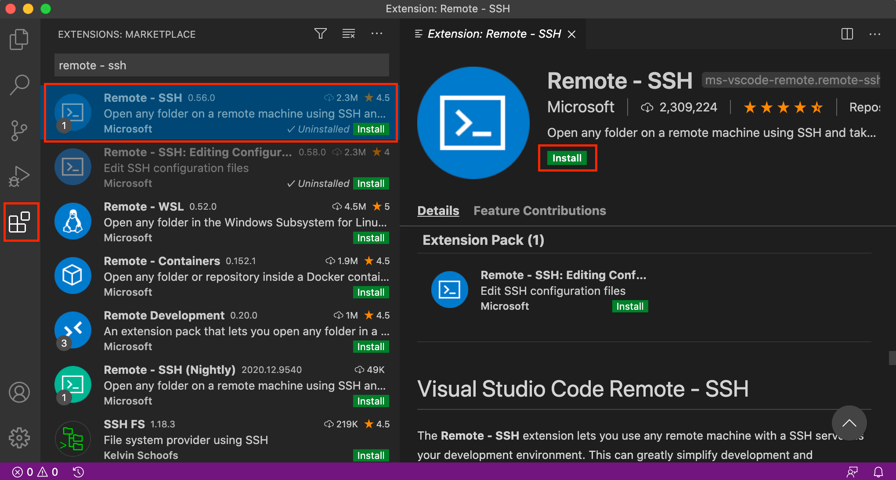

3. Add a new SSH host. Open the Command Palette through the **View**
menu as shown in the following screenshot:

    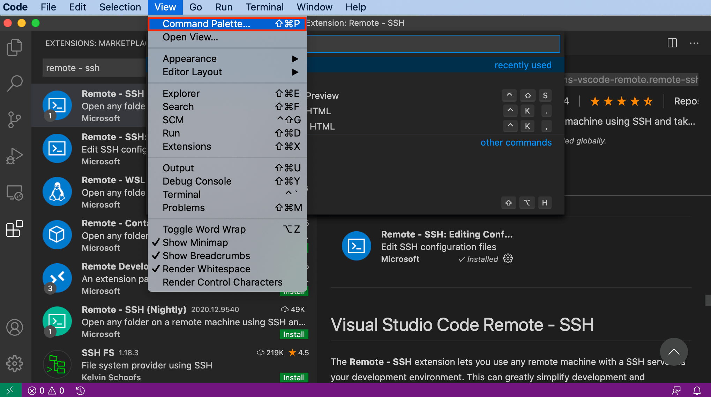

    Search for the command **Remote-SSH: Add New SSH Host...** as shown
    in the following screenshot:

    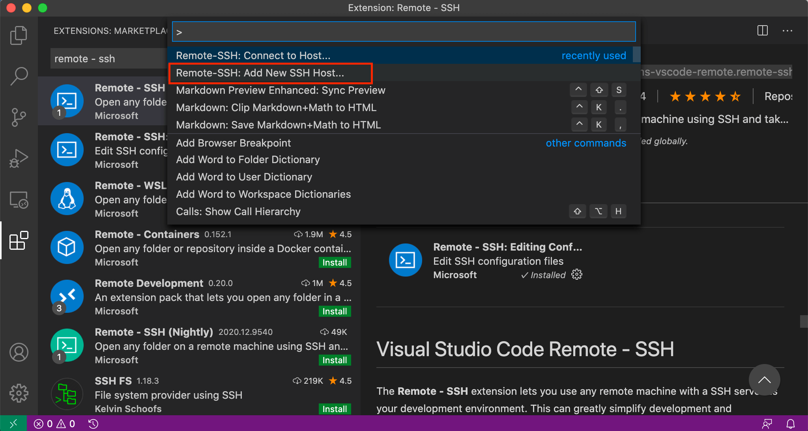

    Follow the prompts to create or update an SSH configuration file and
    add a new SSH Host. 

    Use the user and host/IP `pi@moab.local` when prompted:

    >pi@moab.local

    Use the password `raspberry` when prompted.

    >raspberry

4. Connect to SSH Host. Search for and select the command **Remote-SSH:
Connect to Host...**. Follow the prompts. When you have successfully
connected, you will will see "**SSH: moab.local**" in the bottom left
corner of the VS Code window as shown in the following screenshot:

    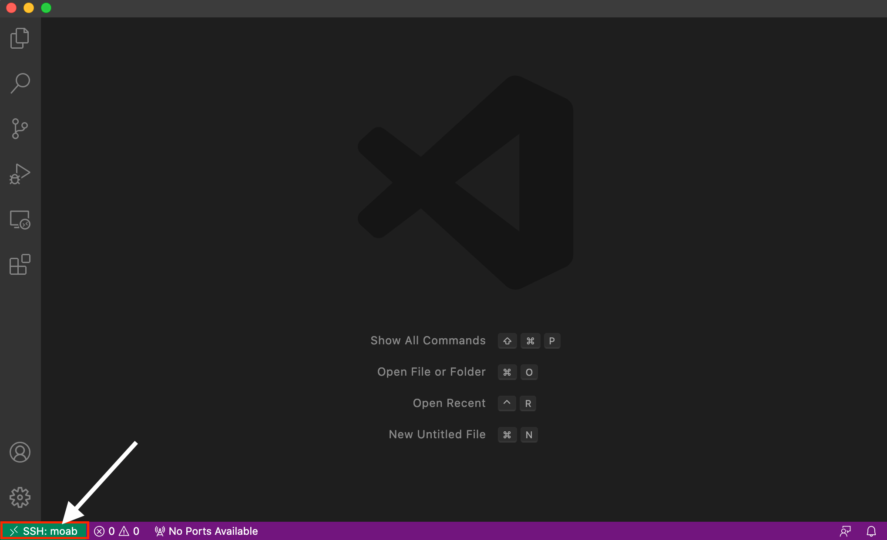

## III. Train and Export a Brain

### Train a brain

If you have not trained a brain already, please follow [Project Moab
tutorial](https://microsoft.github.io/moab/tutorials/) 1, 2 or 3 to
train a brain. 

**Prerequisites**: To complete the tutorials, you must have a Bonsai
workspace provisioned on Azure. If you do not have one, follow the
[account setup
guide](https://docs.microsoft.com/en-us/bonsai/guides/account-setup).

### Export a brain for deployment

1. In the Bonsai UI, Click on “**Export brain**” button in the Train tab
for your trained brain, as in the following screenshot:  

    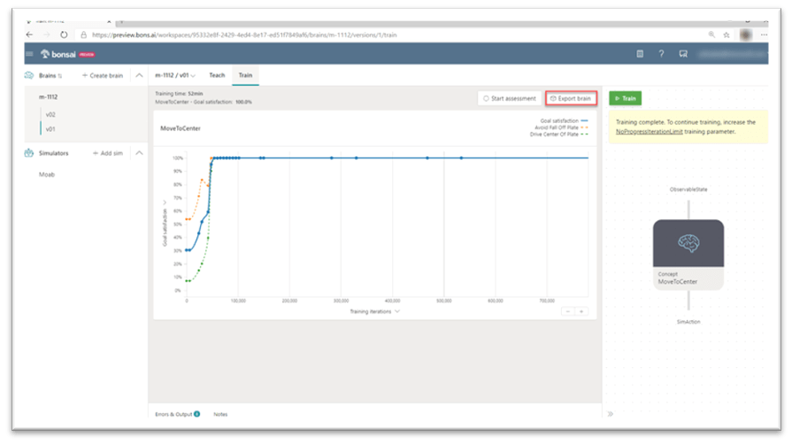

2. In the “**Export brain**” pop-up, under “**Processor architecture**”,
select “Linux” and “**ARM32V7**”, as in the following screenshot:  

    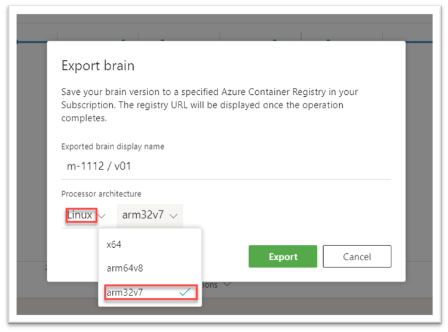

3. Press the “**Export**” button, as in the following screenshot:

    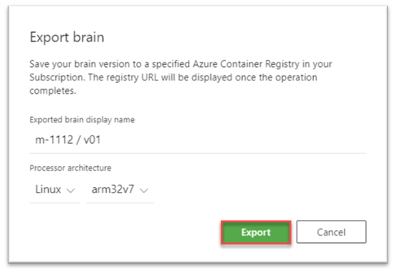

4. The brain version will appear in the **Exported Brains** list on the
left-hand side of the UI with an “**Exporting brain…**” status, as in
the following screenshot:

    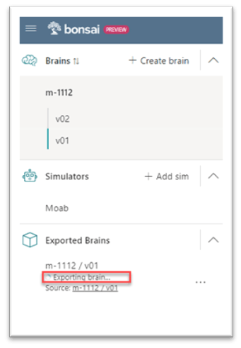

5. After your brain is exported, the “**Brain export complete!**” pop-up
will appear, as in the following screenshot:

    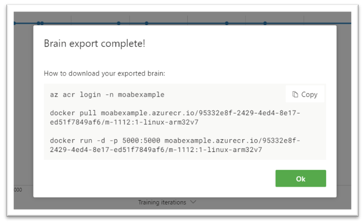

    If the “**Export brain**” pop-up doesn’t appear after the export
    completes, click on the ellipsis (…) and click on “**View download
    info**” , as in the following screenshot:

    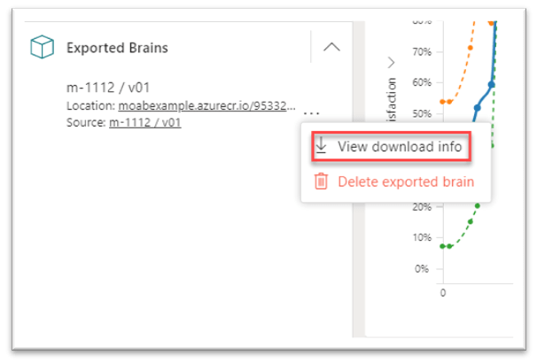

    The “**Download exported brain**” pop-up will appear. It has the
    same download information.

6. Copy the **docker pull** command (middle line) from the exported
brain pop up, as in the following screenshot: 

    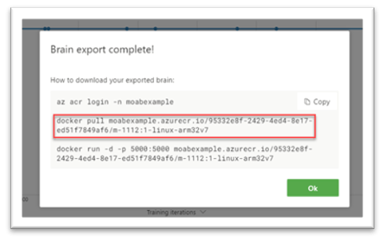

7. Open your favorite text editor and copy/paste the **docker pull**
command.  

    

    You’ll use it to pull down your exported brain into your Moab during
    later steps.

## IV. Deploy a Brain on Moab

### Retrieve ACR credentials

1. Copy/paste the following docker login statement into your text
editor: *(You’ll paste your credentials from your Container Registry
into it during later steps)*

    > `docker login <YOUR LOGIN SERVER> -u <YOUR USERNAME> -p '<YOUR
    > PASSWORD>' `

    

2. Login to [https://portal.azure.com](https://portal.azure.com)

3. Go to your **Bonsai workspace**

4. Click on **Registry** in upper right corner to go to the **Container
Registry** page, as in the following screenshot:  

   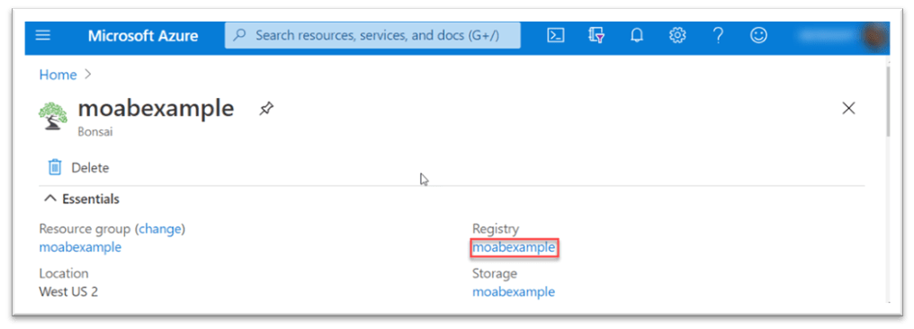

5. On the **Container Registry** page, in the **Settings** section
(left-hand menu), click the **Access Keys** page link, as in the
following screenshot:

   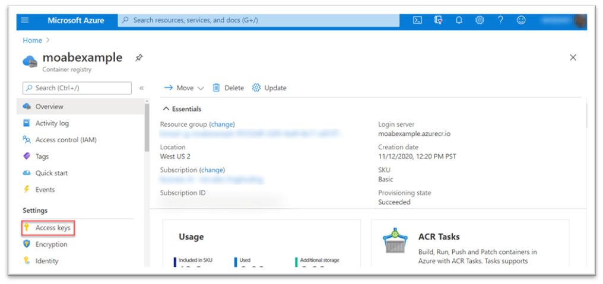

6. In the **Access Keys** page, copy/paste the **Login server** name,
**Username**, and **Password** into a text editor, as in the following
screenshot:

   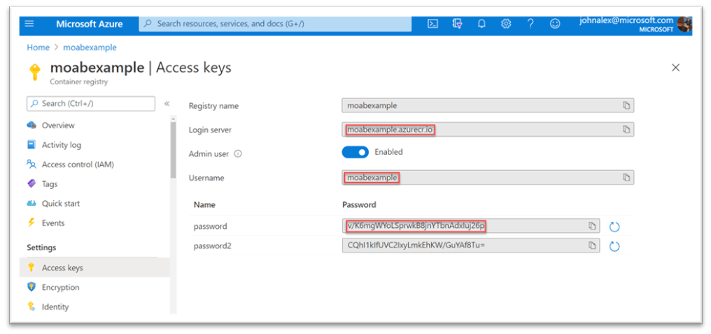

7. In your text editor, replace the `<values>` in the docker login
statement using the fields you copied (keep the single quotes around
password), as in the following example:

   

### Login to ACR from Moab

1. Open Visual Studio Code. If you have not yet already, SSH into Moab
following the previous instructions.

2. Open a new terminal window. You can do this by selecting "**New
Terminal**" from the terminal window as shown in the screenshot below:

    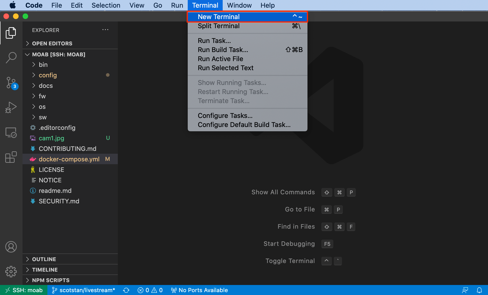

3.	Copy/Paste or type the previously completed **docker login**
statement in to the terminal and hit enter. 

3. Type `cd moab`, and hit enter, to go to the moab directory.

4. Paste the **docker pull** command from your text editor and hit
enter.

5. After the docker pull completes, type `docker images` and hit the
enter to see the exported brain image in the list.

### Edit the docker-compose.yml file

2. Select"**Open Folder**" as shown in the following screenshot.
Alternatively, you can select **File** --> **Open**

    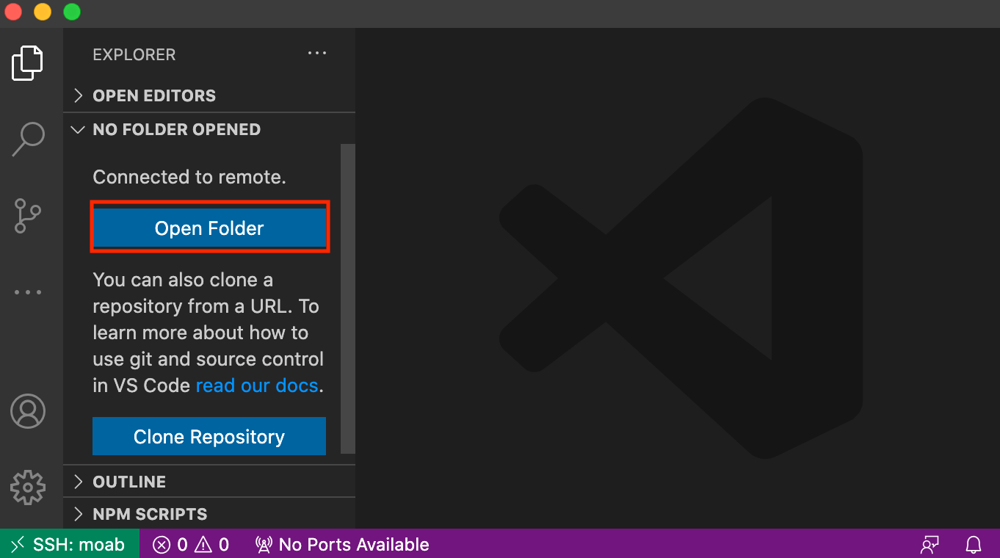

    Select **moab** from the dropdown or type the file path
    `/home/pi/moab/` and select **OK**.

    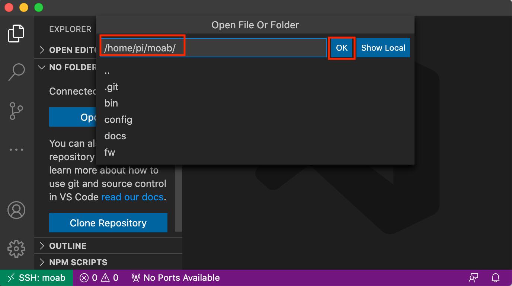

1. Open the **docker-compose.yml** file by selecting in from the menu on
the left.

4. At line 10, delete `moab/brain` and copy/paste the container name of
your exported brain (everything after the words `docker pull`) from the
text editor, as in the following screenshots: 

   

    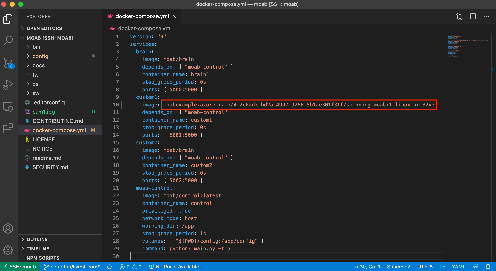


### Restart your Moab and test your deployed brain

1. In the terminal, type `down` and hit enter to terminate the Moab
control service.

2. Type `up` and hit enter to restart the Moab control service.

3. Test your new exported brain on your Moab hardware by selecting
“**Custom 1**” on your Moab menu (don’t forget your ping pong ball!).
